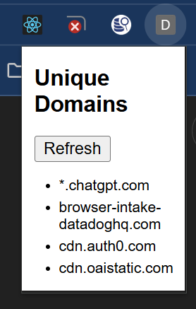

# 🧩 Domain Request Viewer Chrome Extension

This Chrome extension helps you **track and visualize all network requests** made by the current tab. It groups domains by their base suffix and collapses subdomains into wildcards (e.g. `a.example.com` and `b.example.com` → `*.example.com`).

---

## ✨ Features

- ✅ View all domains the current tab has requested
- ✅ Groups domains by base (e.g. `*.google.com`)
- ✅ Deduplicates requests
- ✅ Refresh list with a click
- ✅ Clears data automatically on tab reload
- ❌ Skips `chrome://` and other restricted Chrome pages

---

## 📸 Screenshot

### Example

---

## 📦 Installation

1. Download or clone this repo
2. Go to `chrome://extensions` in Chrome
3. Enable **Developer Mode**
4. Click **Load Unpacked**
5. Select the project folder (with `manifest.json` inside)

---

## 🛠️ Build a Release ZIP (for GitHub Release)

You can run the provided `zip-extension.bat` to create a ZIP archive for uploading to GitHub Releases:

